# Контрольная работа 1

Технологии разработки серверных приложений
Студент: Доськова Мария Павловна
Группа: ЭФБО-03-24
Семестр: 4 семестр, 2025/2026 уч. год

## Инструкция по запуску
1. Клонировать репозиторий:

git clone https://github.com/mitjink/sadt_kr1  
cd 1_kr  

2. Создать и активировать виртуальное окружение:

### Windows
python -m venv venv  
venv\Scripts\activate

### Mac/Linux
python3 -m venv venv  
source venv/bin/activate

3. Установить зависимости:

pip install fastapi uvicorn pydantic

4. Запустить сервер:

uvicorn app:app --reload

5. Открыть в браузере:

Документация Swagger: http://localhost:8000/docs  

Корневой маршрут: http://localhost:8000/

## Задание 1.1

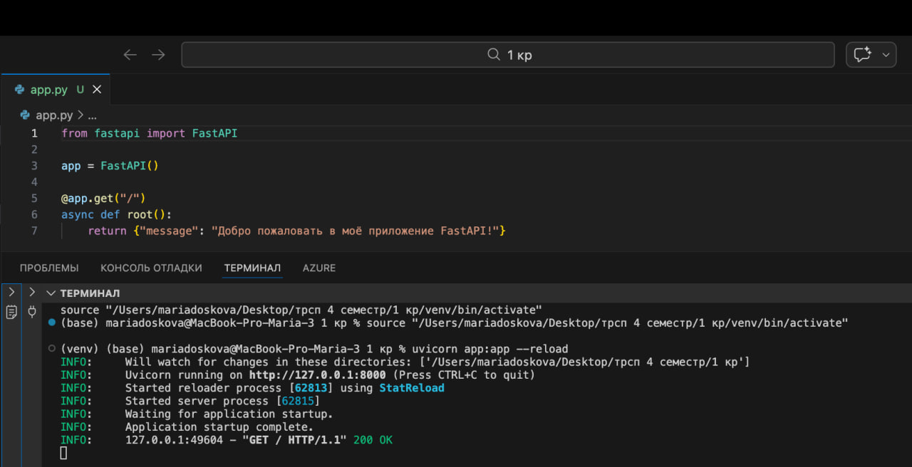
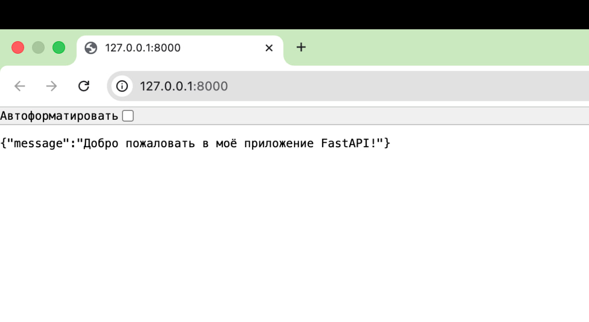
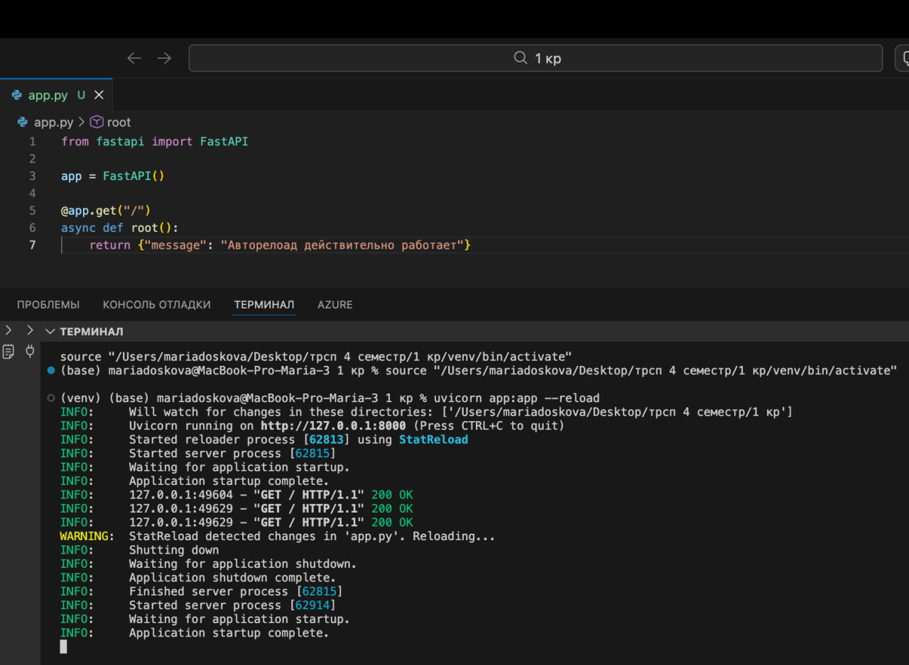
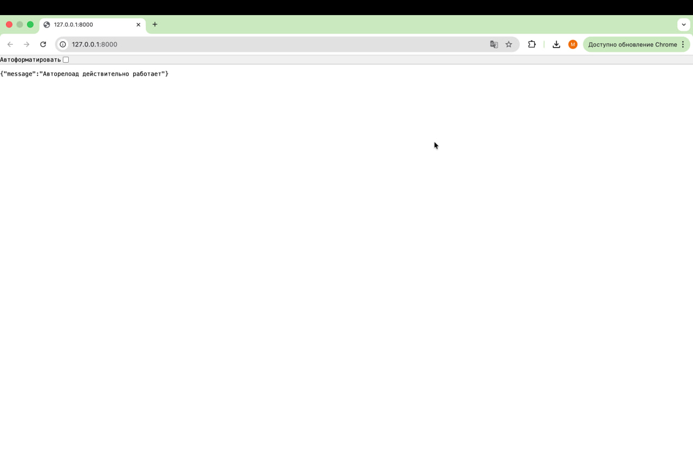

## Задание 1.2

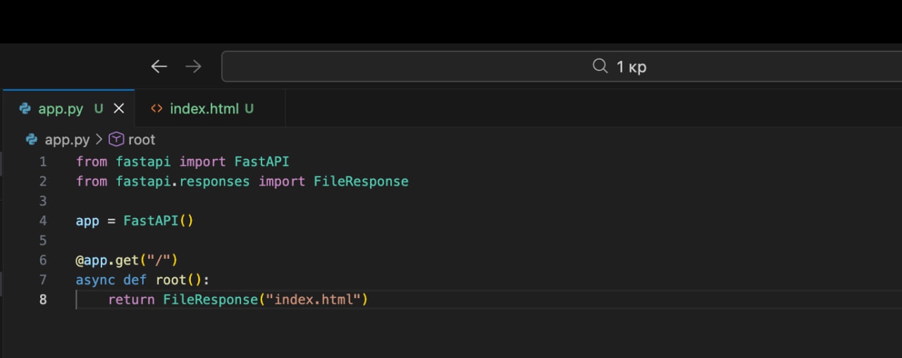
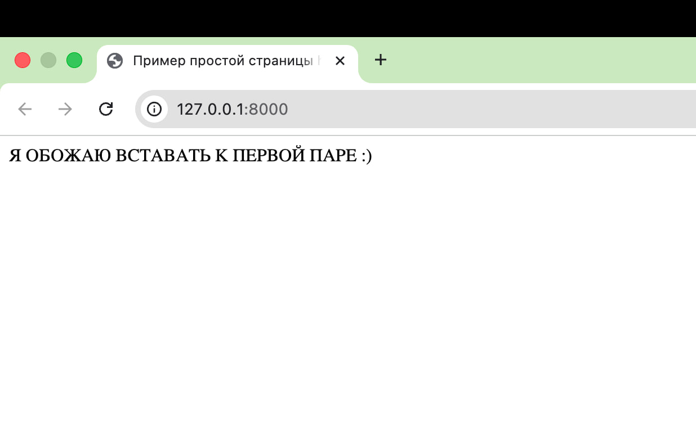

## Задание 1.3

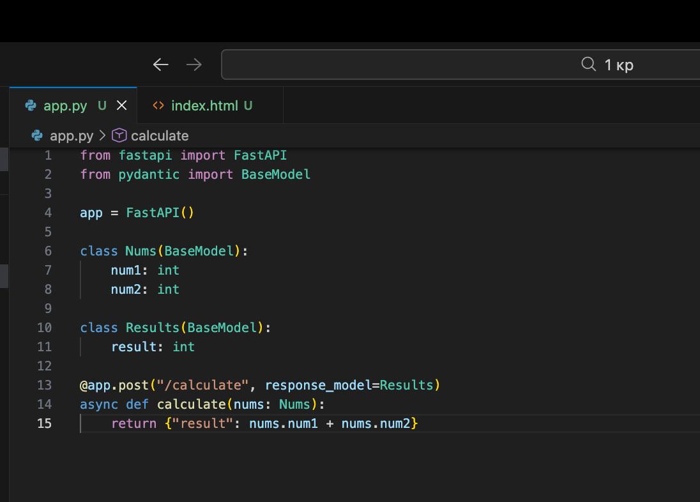
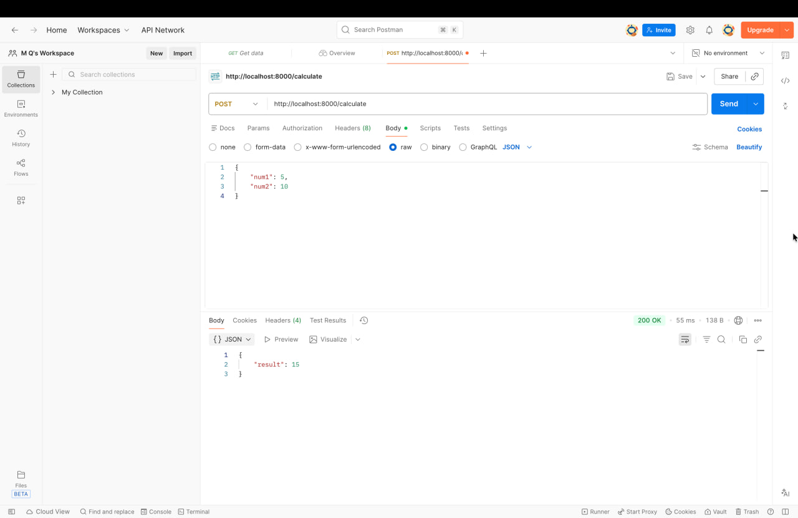

## Задание 1.4

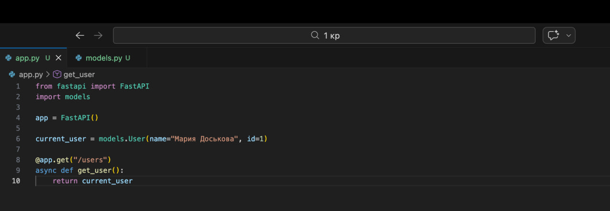
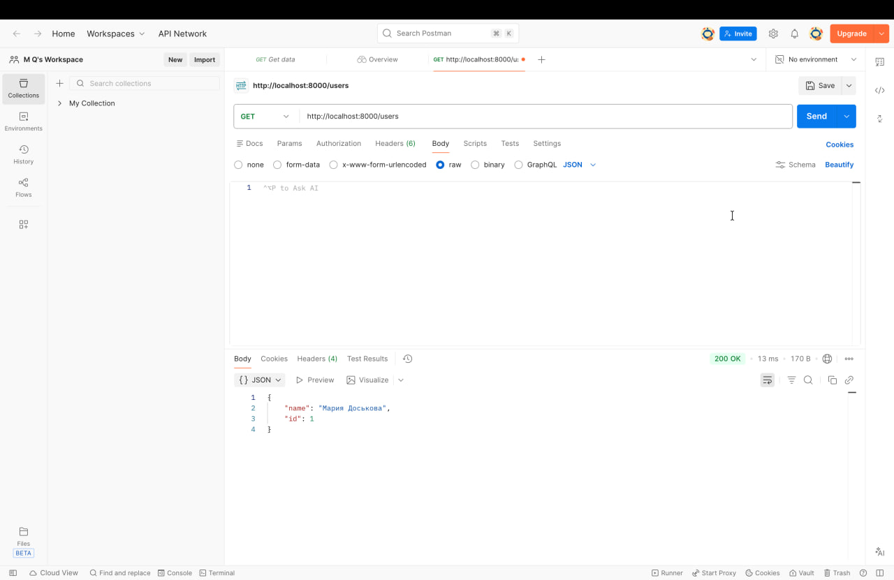

## Задание 1.5

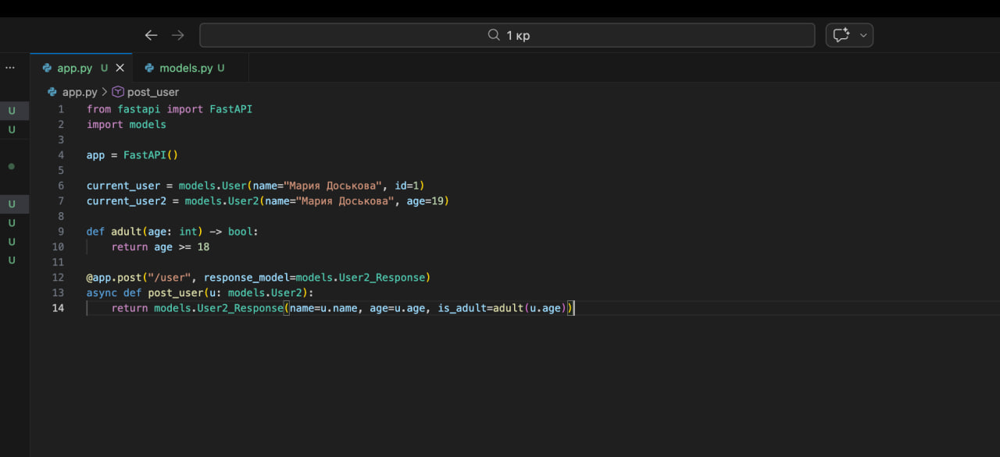
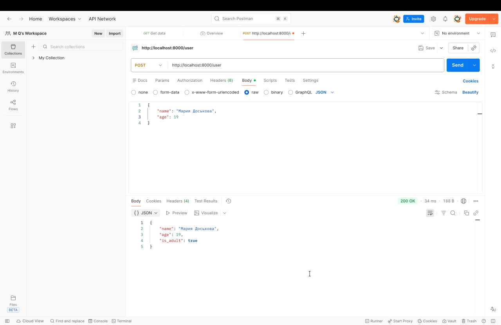

## Задание 2.1

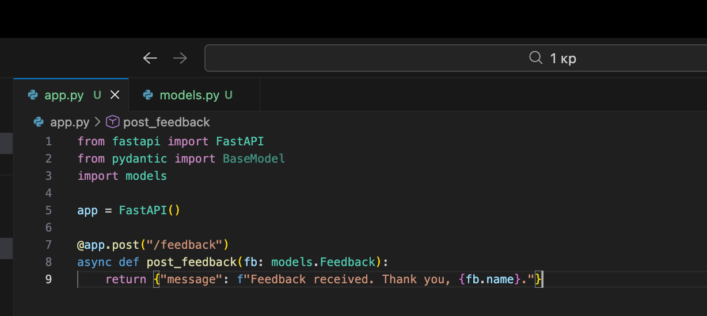

## Задание 2.2

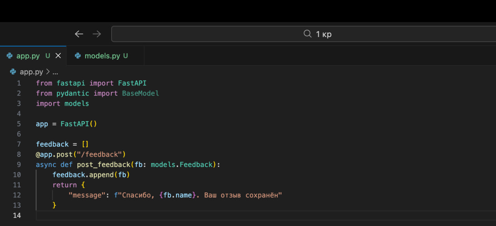
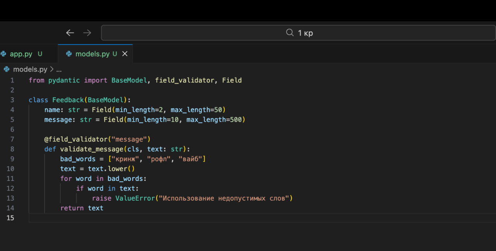
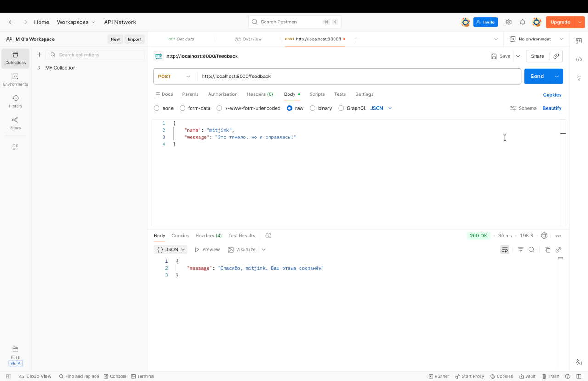

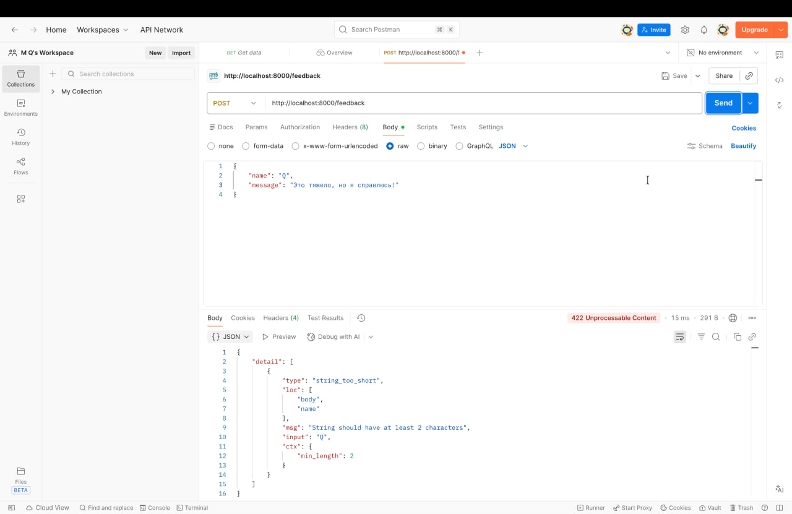